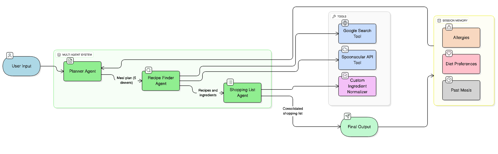
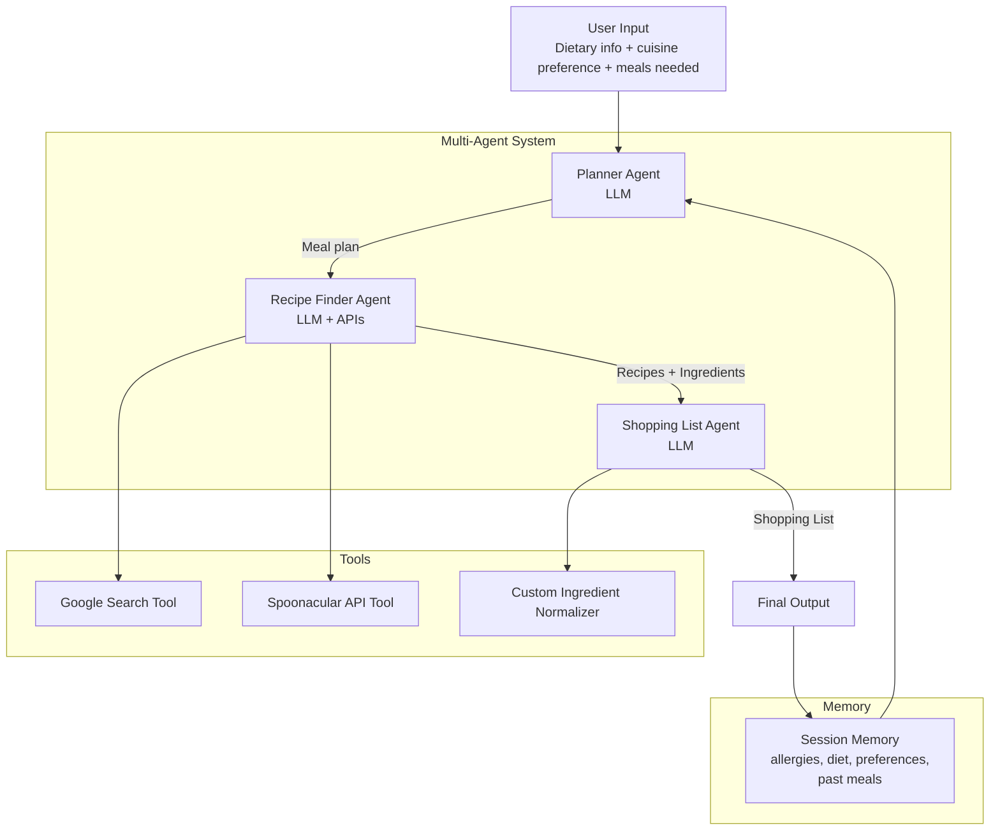

# 🥗 Weekly Meal Planner Agent

An AI-powered **concierge agent system** that automatically plans weekly meals, finds matching recipes, and generates a consolidated shopping list — fully personalized to dietary restrictions, allergies, and cuisine preferences.

---

## 🚀 What it does

1. Takes user inputs:

    * Diet type (vegetarian / vegan / keto etc.)
    * Allergies (nuts / dairy / gluten etc.)
    * Cuisine preferences (Mediterranean, Indian, Asian etc.)
    * Number of meals needed (e.g., 5 dinners per week)
2. Creates a **weekly meal plan**
3. Fetches **real recipes** using external tools/APIs
4. Generates a **normalized shopping list**
5. Remembers user preferences for future runs (session memory)

---

## 🧠 Architecture

This project implements a **multi-agent system** using concepts from the course.




---

## 🔑 Key Concepts Demonstrated (for evaluators)

| Course Concept          | Implementation in this project                                       |
| ----------------------- | -------------------------------------------------------------------- |
| **Multi-agent system**  | Planner → Recipe Finder → Shopping List agents (sequential flow)     |
| **Tools**               | Google Search, Spoonacular API, custom ingredient normalization tool |
| **Sessions & Memory**   | InMemorySessionService saves dietary info + past meals               |
| **Context Engineering** | Compact context passed only with required fields                     |
| **Observability**       | Logging at each agent step (can be expanded further)                 |

---

## 📁 Project Structure

```
/notebooks
  weekly-meal-planner-agent.ipynb   ← main implementation & demo
/src
  planner_agent.py
  recipe_finder_agent.py
  shopping_list_agent.py
  tools/
      google_search.py
      spoonacular.py
      ingredient_normalizer.py
```

---

## 🧪 Example Run

Input:

```
Vegetarian, allergic to nuts
Likes Mediterranean food
Needs 5 dinners
```

Output:

```
Weekly plan with 5 dinners
Recipes pulled from external sources
Consolidated shopping list (nut-safe + vegetarian)
```

---

## ▶️ How to run locally

```bash
git clone <repo-url>
cd weekly-meal-planner-agent
pip install -r requirements.txt
jupyter notebook
```

Open `notebooks/weekly-meal-planner-agent.ipynb` and run all cells.

---

## 🎯 Future Improvements

* UI (Streamlit / Gradio for user interaction)
* Long-term favorite meal suggestions
* Budget-aware / calorie-aware meal plans
* Automatic Instacart / Amazon Fresh shopping integration

---

## 📜 License

MIT License
